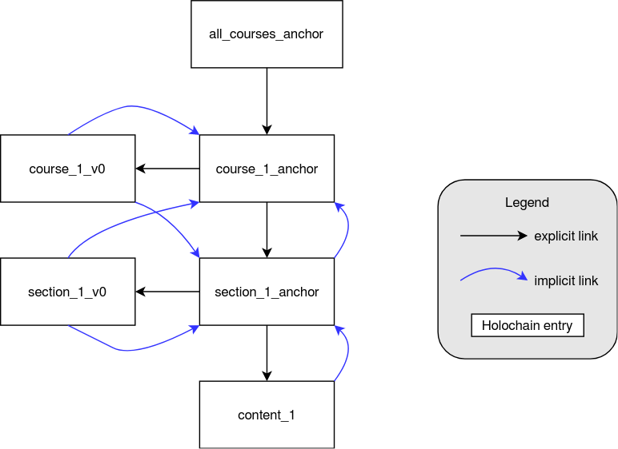

# devcamp7-leap

Leap (Learning Pathways) is a peer-to-peer Udemy inspired learning application built on Holochain.

This particular version of leap is built for the community-ran Holochain DevCamp 7.

## Development

### IDE / editor

There are multiple parts in this repository where the code is located:

- `dna/course/zomes/courses/code` contains Rust backend code
- `dna/course/test` contains backend integration tests

You can either open these directories manually or you can use `leap.code-workspace` file to open the Microsoft Visual Studio Code workspace that would:

- automatically open directories with zome code and integration tests;
- prompt you to install the recommended extensions if they're not already present;
- configure code formatting on each save for Rust files.

To open the workspace file, you can use two ways:

1. open Microsoft Visual Studio Code separately and then go to File > Open Workspace and select the `leap.code-workspace` file in the root of this repo. This would run Visual Studio outside of Holochain shell and it will be loading system level Rust tools
2. start Holochain shell in the root of this repository and inside it run `code .`. This will run Visual Studio inside the Holochain shell and it will be loading Rust tools provided by it.

#### working with rust-analyzer VSC extension

This is applicable for users of Microsoft Visual Studio Code.
There's a great extenstion [rust-analyzer](https://rust-analyzer.github.io/) that simplifies working with code in many different ways. However, there's a catch when using it for a Holochain app: it won't work at first until you build a Rust project directly for each zome:

1. open the project using the workspace file
2. open a VSC terminal in the `code/` directory (Terminal > New Terminal)
3. start a Holochain shell there
4. do `cargo build`

You only need to do it once for a project given that you won't be deleting the build files.

### Building

All code building needs to be done in a Holochain shell which you can start by running:

```
nix-shell https://holochain.love
```

If you don't have it installed, please refer to the [official doc](https://developer.holochain.org/docs/install/).

#### Package the entire DNA

This will build Rust project for every zome in DNA (we have just one) and then package it all into a Holochain format.

1. go to `dna/course`
2. run `hc package`

#### Build Rust project for a zome

This will just build a Rust project using Rust toolchain.

1. go to a zome directory `dna/course/zomes/courses/code`
2. run `cargo build`

## Architecture


## Data model




